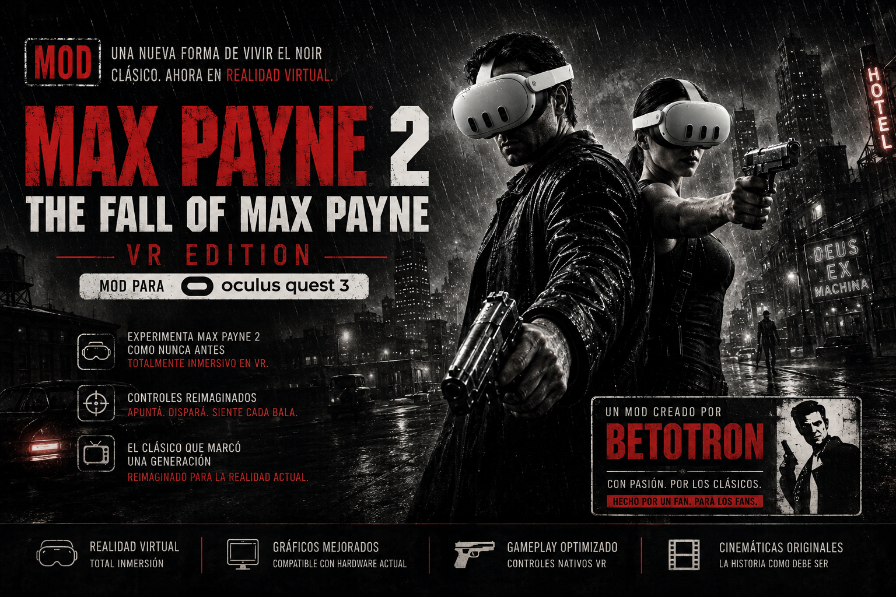

# Max Payne 2 VR

**Realidad virtual nativa para *Max Payne 2: The Fall of Max Payne* (2003).**
Estereoscopia real, cabeza con seguimiento, mandos y apuntado con la mano.



> 🇬🇧 **[English version here](README.md)** · Mod created by **betotron** —
> [github.com/betotron](https://github.com/betotron) · Powered by
> **[techbuzzo.com](https://techbuzzo.com)**

---

## Estado: **versión 1.1 · BETA**

**Se juega de principio a fin y funciona bien.** Pero está **en desarrollo activo**, y prefiero
decirte lo que falta antes de que lo descubras tú.

**Lo que ya funciona bien:**

✅ Estereoscopia real · ✅ cabeza con seguimiento (6 grados de libertad) · ✅ apuntado con la mano ·
✅ menú con los mandos · ✅ panel de vida y balas · ✅ cinemáticas y novela gráfica en pantalla
flotante · ✅ caminar con la palanca y con tus propios pasos

**Lo que todavía está cojo, dicho sin adornos:**

| | |
|---|---|
| 🌤️ **El cielo se mueve contigo** | en exteriores, el fondo esférico gira con tu cabeza en vez de quedarse quieto |
| 💪 **El brazo se tuerce** | al mover mucho el brazo, los huesos se doblan hacia dentro y la ropa se deforma |
| 🔫 **El selector de armas** | a veces ofrece armas que todavía no llevas |
| 🎬 **Los encuadres de las cinemáticas** | van mucho mejor que antes, pero en algunos planos aún hay que girar la cabeza |
| 📖 **Alguna novela gráfica** | la mayoría van a la pantalla flotante; alguna todavía no |
| 💥 **Cierres esporádicos** | el motor de 2003 se cae de vez en cuando por un hueso que él mismo no comprueba. El mod deja escrito el motivo en su registro |

Nada de eso impide jugar. Si te encuentras algo distinto,
**[abre un issue](https://github.com/betotron/MaxPayne2VR-release/issues)** — con el registro
adjunto, si puedes.

---

## Qué es esto

No es una pantalla flotante dentro del casco. El juego se dibuja **dos veces, una por ojo**, con
la cámara del motor movida por tu cabeza. Mueves la cabeza y el mundo se queda quieto; apuntas con
la mano y el arma va donde apuntas; das un paso y Max da un paso.

| | |
|---|---|
| Estereoscopia real | sí, dos vistas por fotograma |
| Cabeza con seguimiento | sí, giro y posición (6 grados de libertad) |
| Apuntado con la mano | sí |
| Menú del juego con los mandos | sí |
| Panel de vida y balas en el mundo | sí |
| Cinemáticas y novela gráfica | en pantalla plana flotante |

---

## ⚠️ Lee esto antes que nada: tu runtime de realidad virtual

Max Payne 2 es un programa de **32 bits**, de 2003. Un programa de 32 bits solo puede hablar con
un **runtime de OpenXR de 32 bits**, y casi todo el software de VR moderno instala solo el de 64.

| runtime | estado |
|---|---|
| **Virtual Desktop** | ✅ **Funciona. Es el único confirmado.** |
| **SteamVR** | ❌ **No funciona.** Solo registra un runtime de 64 bits, así que el juego ni siquiera puede arrancarlo |
| **Oculus / Meta Link y Air Link** | ❌ **No funcionó en nuestras pruebas** |

**Lo que dice el registro del propio mod**, literal, en cada intento:

```
SteamVR          ->  xrCreateInstance -> -51 RUNTIME_UNAVAILABLE   (el runtime no arranca)
Virtual Desktop  ->  runtime VirtualDesktopXR ... sesion EN MARCHA
```

**Sobre Meta Link:** la aplicación de Meta tiene un botón de «usar Oculus como runtime de OpenXR»,
pero cambia **solo la entrada de 64 bits**. La de 32 bits —la única que lee Max Payne 2— se queda
apuntando donde estaba. Los archivos del runtime de 32 bits de Oculus sí existen en el disco, así
que quizá tenga arreglo, pero **no se ha visto funcionar ni una vez** y aquí no se documenta como
compatible.

> ### 👉 Usa Virtual Desktop.
> Es con lo que este mod está desarrollado y probado, con un **Meta Quest 3**.

---

## Qué necesitas

| | |
|---|---|
| **Max Payne 2** | la versión de Steam o de GOG. Hace falta tener el juego |
| **Virtual Desktop** | en el PC y en el casco |
| **Drivers de la tarjeta al día** | el mod usa Vulkan, que viene con el driver |
| **DXVK** | **va incluido en esta descarga.** No tienes que buscarlo |

Nada más. Ni Visual Studio, ni SDKs, ni runtimes aparte.

---

## Instalación

### Paso 1 · Descarga

Botón verde **Code** → **Download ZIP** → descomprímelo donde quieras.

### Paso 2 · Abre la carpeta del juego

En Steam: clic derecho sobre *Max Payne 2* → **Administrar** → **Explorar archivos locales**.
Es la carpeta donde está `MaxPayne2.exe`.

### Paso 3 · Copia el **contenido** de la carpeta `mod`

> ### ⚠️ Lo más importante de toda la guía
> **La carpeta `mod` NO se copia.** Se abre, y se copian **los cinco archivos que hay dentro**,
> sueltos, **junto a `MaxPayne2.exe`**.

**Lo que descargas:**

```
MaxPayne2VR-release/
├── mod/                      <- abre esta carpeta, no la copies
│   ├── winmm.dll             <- el mod
│   ├── MaxPayne2VR.ini       <- sus ajustes
│   ├── d3d8.dll              <- DXVK 3.0.2 (32 bits)
│   ├── d3d9.dll              <- DXVK 3.0.2 (32 bits)
│   └── dxvk.conf             <- ajustes de DXVK
├── README.md
├── README.es.md
└── LICENCIAS.txt
```

**Cómo tiene que quedar la carpeta del juego:**

```
Max Payne 2 The Fall of Max Payne/
├── MaxPayne2.exe             <- ya estaba
├── winmm.dll                 <- ✅ estos cinco los pones tú
├── MaxPayne2VR.ini           <- ✅
├── d3d8.dll                  <- ✅
├── d3d9.dll                  <- ✅
├── dxvk.conf                 <- ✅
└── ...
```

❌ **Mal:** `Max Payne 2\mod\winmm.dll`
✅ **Bien:** `Max Payne 2\winmm.dll`

> **Si ya tienes DXVK, dgVoodoo u otro envoltorio en esa carpeta**, estos archivos van a sustituir
> a `d3d8.dll` y `d3d9.dll`. Haz una copia de los tuyos antes si los quieres recuperar.
>
> **Por qué repartimos DXVK y por qué importa la versión:** el mod coge la imagen que dibuja el
> juego directamente de DXVK, como una imagen de Vulkan, y para eso usa su interfaz interna con la
> disposición exacta de la **versión 3.0.2**. Otra versión puede reordenar esa disposición, y
> cuando eso pasa el juego **se cierra en vez de dar un error**. Por eso la versión probada viene
> en la caja. No la cambies por una más nueva salvo que te apetezca depurar.

### Paso 4 · Ajusta el lanzador del juego — **no te lo saltes**

Al abrir el juego sale primero una ventanita, el lanzador. **Lo que elijas ahí decide la nitidez
de lo que verás dentro del casco.**

| opción | qué poner |
|---|---|
| **Adaptador gráfico** / *Display Adapter* | tu tarjeta (no el adaptador integrado) |
| **Resolución de** / *Screen Mode* | **la más alta de la lista**, y que acabe en **× 32** |
| **Aceleración** | **D3D Hardware T&L** |


**Por qué importa tanto:** el mod coge la imagen que dibuja el juego y la estira hasta el tamaño
que pide el casco. Un Quest 3 pide **2112 × 2304 por ojo**. Si dejas el juego en 800 × 600, esa
imagen se estira casi tres veces y se ve borrosa. **La resolución del lanzador es la calidad que
vas a ver.**

En un equipo de referencia, la lista llega hasta **2715 × 1527 × 32**. En el tuyo puede ser otra:
**coge siempre la última de la lista.**

### Paso 5 · Ponte el casco y juega

1. Arranca **Virtual Desktop** en el PC y conecta desde el casco. **Esto primero.**
2. Abre Max Payne 2 como siempre.
3. El mod se carga solo. No hay que ejecutar nada más.

> ### ⏳ Los primeros segundos verás el juego plano. Es normal.
> El mod tiene que montar OpenXR, crear su propio dispositivo de Vulkan y engancharse al motor
> antes de poder entregar imagen al casco. **Suele tardar unos 10 segundos**, y en un arranque
> lento puede irse a medio minuto.
>
> *(Medido sobre 122 arranques reales: la mitad por debajo de 20 s, nueve de cada diez por debajo
> de 30 s. En el equipo de referencia, 10 s.)*
>
> **No cierres el juego durante esa espera.** Cuando entra, entra de golpe.

Si el juego abre en el monitor y **pasado medio minuto** sigue sin llegar al casco, es que Virtual
Desktop no estaba conectado a tiempo. Cierra el juego, conecta, y vuelve a abrirlo.

---

## La primera vez

- **Ponte en posición T** (los dos brazos abiertos en cruz) durante un par de segundos en los
  primeros minutos. El mod mide tu brazo solo y se lo guarda. **No tienes que pulsar nada.**
- Si te ves más alto o más bajo que los personajes del juego, cambia `camara_altura_ojos` en el
  `.ini`. **Puedes hacerlo con el juego abierto:** guardas el archivo y se aplica solo.

---

## ¿Lo quieres en español, con voces?

El juego viene en inglés. Hay una guía de Steam que lo traduce **entero — voces y textos**:

> ### 🇪🇸 [Traducción al español de Max Payne 2, tanto voces como textos](https://steamcommunity.com/sharedfiles/filedetails/?id=198579259)

Sigue los pasos de esa guía. Se puede hacer **antes o después** de instalar el mod: son cosas
independientes y no se estorban.

> **Dos avisos honestos.**
>
> Esa traducción **sí reemplaza archivos del juego** —a diferencia de este mod, que solo añade los
> suyos—. Haz una copia de la carpeta antes, o cuenta con reinstalar desde Steam si quieres
> volver atrás.
>
> Y no la hemos probado junto al mod. **No debería dar problemas** —el mod no lee los archivos de
> texto ni de voz del juego— pero eso es un razonamiento, no una medida. Si la usas y algo va
> raro, abre un issue y lo miramos.

---

## Los mandos — Meta Quest 3

Con los mandos Touch Plus. **Tu cabeza gira la cámara**, así que la palanca derecha queda libre.

### Mando derecho

| botón | qué hace |
|---|---|
| 🔫 **Gatillo** | **Disparar**. Con el selector de armas abierto, **elige el arma** |
| ✊ **Agarre** (lateral) | **Usar / interactuar** (puertas, objetos) |
| **A** | **Recargar** |
| **B** | **Saltar** |
| 🕹️ **Clic de la palanca** | **Analgésico** (painkiller) |
| 🕹️ **Palanca** | nada — giras con la cabeza |
| ✋ **Apuntar** | el arma va **donde apunta tu mano** |

### Mando izquierdo

| botón | qué hace |
|---|---|
| 🕹️ **Palanca** | **Caminar** (adelante, atrás y a los lados) |
| ✊ **Agarre** (lateral) | **Golpe cuerpo a cuerpo** |
| **X** | **Tiempo bala** (cámara lenta) |
| **Y** | **Selector de armas** — cada pulsación pasa a la siguiente; el gatillo derecho la elige |
| ☰ **Botón de las tres rayitas** | **Abrir y cerrar el menú del juego** (hace de `ESC`) |

### Dentro del menú del juego

| | |
|---|---|
| 🕹️ **Palanca izquierda** | arriba y abajo para moverte; izquierda y derecha para cambiar un valor |
| 🔫 **Gatillo** (cualquier mano) | elegir la opción |
| **B / Y** | volver atrás |

### Tu cuerpo

| | |
|---|---|
| **Girar la cabeza** | gira la cámara. El cuerpo de Max te sigue con retraso, para no marear |
| **Dar un paso de verdad** | Max camina en esa dirección |
| **Agacharte / asomarte** | el ojo se mueve de verdad (6 grados de libertad) |

### Teclas del teclado (para afinar, opcional)

| tecla | qué hace |
|---|---|
| **M** / **N** | subir / bajar la altura de los ojos, un centímetro por toque |
| **,** / **.** | juntar / separar los ojos, un milímetro por toque |

**Todos los botones se pueden cambiar** desde `MaxPayne2VR.ini`, y casi todos **con el juego
abierto**.

---

## Ajustes

Todo está en `MaxPayne2VR.ini`, en castellano y explicado **ajuste por ajuste**, con lo que hace,
qué valores admite y qué vas a notar al cambiarlo.

La mayoría se cambian **sin cerrar el juego**: guardas el archivo y el mod lo aplica solo. Los
que no, lo dicen.

---

## Si algo no funciona

| lo que ves | qué mirar |
|---|---|
| El juego abre pero **no entra en el casco** | conecta Virtual Desktop **antes** de abrirlo. Si estás con SteamVR o Meta Link, no puede funcionar — mira la sección de runtimes |
| Se ve **borroso** | la resolución del lanzador. Ponla al máximo (paso 4) |
| Se ve **plano**, sin relieve | faltan `d3d8.dll` / `d3d9.dll`, o no se copiaron. Los cinco archivos van en la carpeta del juego |
| **Nada** cambia al abrir el juego | `winmm.dll` está en el sitio equivocado. Tiene que estar **junto a `MaxPayne2.exe`**, no dentro de `mod\` |
| El juego **se cierra al arrancar** | si cambiaste el DXVK incluido por otra versión, vuelve a poner el nuestro |
| El brazo se comporta raro | ponte en posición T unos segundos para que te vuelva a medir |

El mod deja **`MaxPayne2VR.log`** en la carpeta del juego, que dice qué se pidió y qué se aplicó
de verdad — incluido el motivo exacto por el que no se pudo llegar al casco. Si abres un issue,
adjúntalo: contesta la mitad de las preguntas él solo.

---

## Desinstalar

Borra `winmm.dll` y `MaxPayne2VR.ini`. El juego vuelve a la normalidad.
Si además quieres deshacer DXVK, borra `d3d8.dll`, `d3d9.dll` y `dxvk.conf`.

**No se ha modificado ningún archivo del juego en ningún momento.**

---

## Créditos y licencias

Mod creado por **betotron** — [github.com/betotron](https://github.com/betotron)
Powered by **[techbuzzo.com](https://techbuzzo.com)**

*Max Payne 2: The Fall of Max Payne* es propiedad de **Remedy Entertainment** y **Rockstar
Games**. Este mod **no contiene ni distribuye ningún archivo del juego**. Hace falta tener el
juego original.

Software de terceros incluido en esta descarga, repartido bajo su propia licencia:

| | |
|---|---|
| **DXVK** 3.0.2 (`d3d8.dll`, `d3d9.dll`) | Philip Rebohle y colaboradores — licencia zlib/libpng |
| **Cargador de OpenXR** (enlazado dentro de `winmm.dll`) | The Khronos Group — Apache 2.0 |

Los textos completos, en [`LICENCIAS.txt`](LICENCIAS.txt).

---

## Version

| | |
|---|---|
| version | **1.1 BETA** |
| candidato interno | `C-235` |
| SHA-256 de `winmm.dll` | `76FD1F14D4E9AE3B78565A52AA1B020D3705998C1BCF5DC818430C11642F8F2E` |
| DXVK incluido | 3.0.2 (32 bits) |

