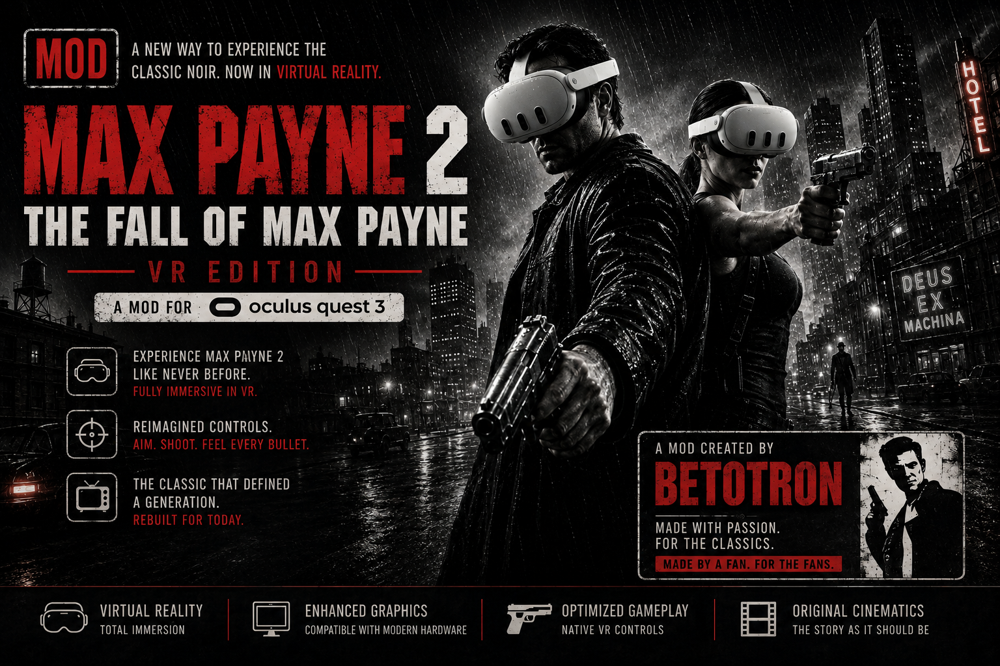
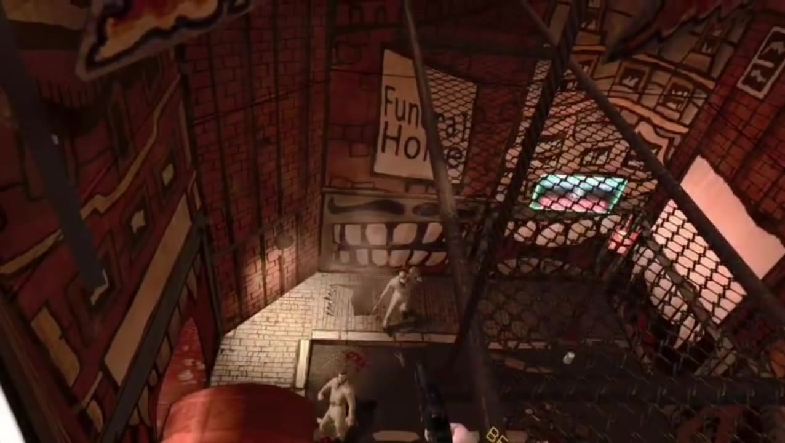
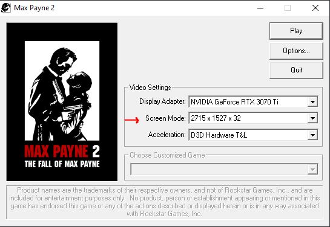

# Max Payne 2 VR

**Native virtual reality for *Max Payne 2: The Fall of Max Payne* (2003).**
Real stereoscopy, head tracking, motion controllers, and aiming with your hand.



### 🎬 See it running

[](https://github.com/betotron/MaxPayne2VR-release/blob/main/demo/MaxPayne2VR-demo.mp4)

*(a minute of real gameplay, recorded inside the headset)*


> 🇪🇸 **[Versión en español aquí](README.es.md)** · Mod created by **betotron** —
> [github.com/betotron](https://github.com/betotron) · Powered by
> **[techbuzzo.com](https://techbuzzo.com)**

---

## Status: **version 1.1 · BETA**

**It plays from start to finish and it works well.** But it is **under active development**, and
I'd rather tell you what's missing than let you find out on your own.

**What already works well:**

✅ Real stereoscopy · ✅ head tracking (6 degrees of freedom) · ✅ hand aiming · ✅ menu with the
controllers · ✅ health and ammo panel · ✅ cutscenes and graphic novels on a floating screen ·
✅ walking with the stick and with your own steps

**What's still rough, said plainly:**

| | |
|---|---|
| 🌤️ **The sky moves with you** | outdoors, the spherical background turns with your head instead of staying put |
| 💪 **The arm twists** | move the arm a lot and the bones fold inward, deforming the clothing |
| 🔫 **The weapon selector** | sometimes offers weapons you aren't carrying yet |
| 🎬 **Cutscene framing** | much better than it was, but some shots still make you turn your head |
| 📖 **The odd graphic novel** | most reach the floating screen; a few still don't |
| 💥 **Occasional crashes** | the 2003 engine sometimes trips over a bone it never checks itself. The mod writes the reason to its log |

None of that stops you playing. If you hit something different,
**[open an issue](https://github.com/betotron/MaxPayne2VR-release/issues)** — with the log
attached if you can.

---

## ☕ Enjoying it? Buy me a coffee

This mod is made by **one person**, in their spare time, and it is **free and always will be**.

Putting virtual reality inside a 2003 engine that never imagined it takes months: decompiling the
game, finding where everything lives, and testing it with the headset on over and over. If it made
your day and you'd like it to keep improving — or to see the same done to other games — a donation
helps more than you'd think.

> ### 💙 [Say thanks with a donation](https://donate.stripe.com/7sY00la1I37i8el75YbII04?locale=en)

No obligation at all, and nothing unlocks when you pay: **the mod is the same for everyone.**
Telling a friend or leaving a ⭐ on the repository helps too.


---

## What this is

This is not a floating screen inside your headset. The game is rendered **twice, once per eye**,
with the engine's own camera driven by your head. You turn your head and the world stays put; you
point your hand and the gun goes where you point; you take a step and Max takes a step.

| | |
|---|---|
| Real stereoscopy | yes, two views per frame |
| Head tracking | yes, rotation and position (6 degrees of freedom) |
| Hand aiming | yes |
| Game menu with the controllers | yes |
| Health and ammo panel in world space | yes |
| Cutscenes and graphic novels | on a floating flat screen |

---

## ⚠️ Read this before anything else: your VR runtime

Max Payne 2 is a **32-bit** program from 2003. A 32-bit program can only talk to a **32-bit
OpenXR runtime**, and most modern VR software only installs a 64-bit one.

| runtime | status |
|---|---|
| **Virtual Desktop** | ✅ **Works. It is the only one confirmed working.** |
| **SteamVR** | ❌ **Does not work.** It only registers a 64-bit runtime, so the game cannot even start it |
| **Oculus / Meta Link and Air Link** | ❌ **Did not work in our tests** |

**What the mod's own log says**, word for word, on each attempt:

```
SteamVR    ->  xrCreateInstance -> -51 RUNTIME_UNAVAILABLE   (the runtime never starts)
Virtual Desktop ->  runtime VirtualDesktopXR ... session RUNNING
```

**About Meta Link:** the Meta app has a "Set Oculus as active OpenXR runtime" button, but it
switches only the **64-bit** entry. The 32-bit entry — the only one Max Payne 2 reads — stays
pointing wherever it was. The Oculus 32-bit runtime files do exist on disk, so it may be
fixable, but **it has never been seen working** and it is not documented here as supported.

> ### 👉 Use Virtual Desktop.
> It is what this mod was developed and tested on, with a **Meta Quest 3**.

---

## What you need

| | |
|---|---|
| **Max Payne 2** | the Steam or GOG version. You need to own the game |
| **Virtual Desktop** | on the PC and on the headset |
| **Up-to-date GPU drivers** | the mod uses Vulkan, which ships with your driver |
| **DXVK** | **included in this download.** You do not have to find it |

Nothing else. No Visual Studio, no SDKs, no separate runtimes.

---

## Installation

### Step 1 · Download

Green **Code** button → **Download ZIP** → unzip it anywhere.

### Step 2 · Open the game folder

In Steam: right-click *Max Payne 2* → **Manage** → **Browse local files**.
It's the folder that contains `MaxPayne2.exe`.

### Step 3 · Copy the **contents** of the `mod` folder

> ### ⚠️ The single most important thing in this guide
> **Do NOT copy the `mod` folder itself.** Open it, and copy **the five files inside**, loose,
> **next to `MaxPayne2.exe`**.

**What you downloaded:**

```
MaxPayne2VR-release/
├── mod/                      <- open this folder, don't copy it
│   ├── winmm.dll             <- the mod
│   ├── MaxPayne2VR.ini       <- its settings
│   ├── d3d8.dll              <- DXVK 3.0.2 (32-bit)
│   ├── d3d9.dll              <- DXVK 3.0.2 (32-bit)
│   └── dxvk.conf             <- DXVK settings
├── README.md
├── README.es.md
└── LICENCIAS.txt
```

**How the game folder has to end up:**

```
Max Payne 2 The Fall of Max Payne/
├── MaxPayne2.exe             <- was already there
├── winmm.dll                 <- ✅ you added these five
├── MaxPayne2VR.ini           <- ✅
├── d3d8.dll                  <- ✅
├── d3d9.dll                  <- ✅
├── dxvk.conf                 <- ✅
└── ...
```

❌ **Wrong:** `Max Payne 2\mod\winmm.dll`
✅ **Right:** `Max Payne 2\winmm.dll`

> **If you already have DXVK, dgVoodoo or another wrapper in that folder**, these files will
> replace `d3d8.dll` and `d3d9.dll`. Back up yours first if you want them back.
>
> **Why we ship DXVK and why the version matters:** the mod reads the game's rendered frame
> straight out of DXVK as a Vulkan image, and to do that it uses DXVK's internal interface with
> the exact layout of **version 3.0.2**. A different version can rearrange that layout, and when
> that happens the game **closes instead of showing an error**. So the tested version comes in
> the box. Don't swap it for a newer one unless you enjoy debugging.

### Step 4 · Set up the game launcher — **do not skip this**

When you start the game, a small launcher window opens first. **What you pick there decides how
sharp everything looks inside the headset.**

| option | what to pick |
|---|---|
| **Display Adapter** | your GPU (not the integrated one) |
| **Screen Mode** | **the highest one in the list**, ending in **× 32** |
| **Acceleration** | **D3D Hardware T&L** |



**Why it matters so much:** the mod takes the image the game renders and stretches it to the size
the headset asks for. A Quest 3 asks for **2112 × 2304 per eye**. If you leave the game at
800 × 600, that image gets stretched almost three times and looks blurry. **The launcher
resolution is the quality you will see.**

On a reference machine the list goes up to **2715 × 1527 × 32**. Yours may differ — **always pick
the last entry in the list.**

### Step 5 · Put the headset on and play

1. Start **Virtual Desktop** on the PC and connect from the headset. **Do this first.**
2. Launch Max Payne 2 as usual.
3. The mod loads itself. There is nothing else to run.

> ### ⏳ The first few seconds you will see the game flat. That's normal.
> The mod has to bring up OpenXR, create its own Vulkan device and hook into the engine before it
> can deliver anything to the headset. **It usually takes about 10 seconds**, and on a slow start
> it can stretch to half a minute.
>
> *(Measured over 122 real starts: half of them under 20 s, nine out of ten under 30 s. On the
> reference machine, 10 s.)*
>
> **Don't close the game during that wait.** When it kicks in, it kicks in all at once.

If the game opens on the monitor and **after half a minute** it still hasn't reached the headset,
Virtual Desktop wasn't connected in time. Close the game, connect, and try again.

---

## The first time

- **Stand in a T-pose** (both arms straight out to the sides) for a couple of seconds during the
  first few minutes. The mod measures your arm on its own and saves it. **You don't press
  anything.**
- If you feel taller or shorter than the characters in the game, change `camara_altura_ojos` in
  the `.ini`. **You can do it with the game running:** save the file and it applies itself.

---

## Want it in Spanish, with dubbed voices?

The game ships in English. There is a Steam guide that translates it **completely — both voices
and text**:

> ### 🇪🇸 [Traducción al español de Max Payne 2, tanto voces como textos](https://steamcommunity.com/sharedfiles/filedetails/?id=198579259)

Follow that guide's steps. You can do it **before or after** installing the mod: they are
independent and don't interfere.

> **Two honest warnings.**
>
> That translation **does replace game files** — unlike this mod, which only adds its own. Back up
> the folder first, or be ready to reinstall from Steam if you want to undo it.
>
> And we have not tested it together with the mod. **It shouldn't cause problems** — the mod never
> reads the game's text or voice files — but that is reasoning, not a measurement. If you use it
> and something looks off, open an issue.

---

## Controls — Meta Quest 3

With Touch Plus controllers. **Your head turns the camera**, which leaves the right stick free.

### Right controller

| button | what it does |
|---|---|
| 🔫 **Trigger** | **Fire**. With the weapon selector open, **confirms the weapon** |
| ✊ **Grip** (side) | **Use / interact** (doors, objects) |
| **A** | **Reload** |
| **B** | **Jump** |
| 🕹️ **Stick click** | **Painkiller** |
| 🕹️ **Stick** | nothing — you turn with your head |
| ✋ **Aim** | the gun points **where your hand points** |

### Left controller

| button | what it does |
|---|---|
| 🕹️ **Stick** | **Walk** (forward, back and strafe) |
| ✊ **Grip** (side) | **Melee attack** |
| **X** | **Bullet time** (slow motion) |
| **Y** | **Weapon selector** — each press steps to the next; the right trigger confirms |
| ☰ **Menu button** | **Open and close the game menu** (acts as `ESC`) |

### Inside the game menu

| | |
|---|---|
| 🕹️ **Left stick** | up/down to move; left/right to change a value |
| 🔫 **Trigger** (either hand) | select the option |
| **B / Y** | go back |

### Your body

| | |
|---|---|
| **Turn your head** | turns the camera. Max's body follows with a delay, so it doesn't make you sick |
| **Take a real step** | Max walks that way |
| **Crouch / lean** | your eye actually moves (6 degrees of freedom) |

### Keyboard keys (optional fine-tuning)

| key | what it does |
|---|---|
| **M** / **N** | raise / lower eye height, one centimetre per press |
| **,** / **.** | move the eyes closer / further apart, one millimetre per press |

**Every button can be remapped** in `MaxPayne2VR.ini`, and most of them **while the game is
running**.

---

## Settings

Everything lives in `MaxPayne2VR.ini`, documented **setting by setting** — what it does, what
values it takes, and what you will notice when you change it.

Most of them apply **without closing the game**: save the file and the mod picks it up. The ones
that can't say so.

> The `.ini` and its setting names are in Spanish, so the file and the mod match. If you need it
> in English, open an issue.

---

## Troubleshooting

| what you see | what to check |
|---|---|
| The game starts but **never enters the headset** | connect Virtual Desktop **before** launching. If you are on SteamVR or Meta Link, it cannot work — see the runtime section |
| It looks **blurry** | the launcher resolution. Set it to the maximum (step 4) |
| It looks **flat**, no depth | `d3d8.dll` / `d3d9.dll` are missing or were not copied. All five files go in the game folder |
| **Nothing** changes when you launch | `winmm.dll` is in the wrong place. It must sit **next to `MaxPayne2.exe`**, not inside `mod\` |
| The game **closes on startup** | if you replaced the bundled DXVK with another version, put ours back |
| The arm behaves strangely | stand in a T-pose for a few seconds so it measures you again |

The mod writes **`MaxPayne2VR.log`** in the game folder, saying what was requested and what was
actually applied — including the exact reason the headset could not be reached. If you open an
issue, attach it: it answers half the questions on its own.

---

## Uninstalling

Delete `winmm.dll` and `MaxPayne2VR.ini`. The game goes back to normal.
If you also want to undo DXVK, delete `d3d8.dll`, `d3d9.dll` and `dxvk.conf`.

**No game file has been modified at any point.**

---

## Credits and licences

Mod created by **betotron** — [github.com/betotron](https://github.com/betotron)
Powered by **[techbuzzo.com](https://techbuzzo.com)**

*Max Payne 2: The Fall of Max Payne* is the property of **Remedy Entertainment** and **Rockstar
Games**. This mod **contains and distributes no game files**. You need to own the original game.

Third-party software included in this download, redistributed under its own licence:

| | |
|---|---|
| **DXVK** 3.0.2 (`d3d8.dll`, `d3d9.dll`) | Philip Rebohle and contributors — zlib/libpng licence |
| **OpenXR loader** (linked inside `winmm.dll`) | The Khronos Group — Apache 2.0 |

Full texts in [`LICENCIAS.txt`](LICENCIAS.txt).

---

## Version

| | |
|---|---|
| version | **1.1 BETA** |
| internal build | `C-235` |
| SHA-256 of `winmm.dll` | `76FD1F14D4E9AE3B78565A52AA1B020D3705998C1BCF5DC818430C11642F8F2E` |
| DXVK bundled | 3.0.2 (32-bit) |

